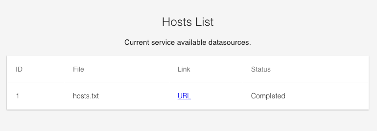

# Hosts Blackhole

   

[](/LICENSE.md)


BEST hosts list processing helper for ad-blocking/blocker programs: AdGuard, AdAway, blocky, grimd...

## Data sources Supported

Currently supported data sources:

<table><thead><tr><th>Project</th><th>Files</th></tr></thead>
<tbody>
<tr><td>
<a href="https://github.com/StevenBlack/hosts">StevenBlack/hosts</a>
</td>
<td><a href="https://raw.githubusercontent.com/StevenBlack/hosts/master/hosts">File</a></td></tr>
<tr><td>
<a href="https://gitlab.com/quidsup/notrack-blocklists">quidsup/notrack-blocklists</a>
</td>
<td><a href="https://gitlab.com/quidsup/notrack-blocklists/raw/master/notrack-blocklist.txt">File1</a> / <a href="https://gitlab.com/quidsup/notrack-blocklists/raw/master/notrack-malware.txt">File2</a></td></tr>
<tr><td>
<a href="https://github.com/AdAway/adaway.github.io/">AdAway/adaway.github.io</a>
</td>
<td><a href="https://github.com/AdAway/adaway.github.io/blob/master/hosts.txt">File1</a> / <a href="https://adaway.org/hosts.txt">File2</a></td></tr>
<tr><td>
<a href="https://github.com/AdguardTeam/AdGuardSDNSFilter">AdguardTeam/AdGuardSDNSFilter</a>
</td>
<td><a href="https://adguardteam.github.io/AdGuardSDNSFilter/Filters/filter.txt">File</a></td></tr>
</tbody></table>

Hosts Count:

```bash
 - AdAway default blocklist  =        7038   
 - AdGuard DNS filter        =       45842   
 - StevenBlack/hosts         =      143542   
 - NoTrack Tracker Blocklist =       14698   
 - NoTrack Malware Blocklist =         305  
```

## CLI && ENV

CLI parameters:

```bash
  --debug      enable debug mode
  --port int   web port (default 8345)
```

usage: `./hbh --port=8345 --debug=false`

Env variables:

```bash
HBH_DEBUG=true
HBH_PORT=1024
```

usage: `HBH_DEBUG=true HBH_PORT=1024 ./hbh`

## APIs && Pages

API:

- `/data/hosts.txt` Get data file which contains all domains.
- `/ping` Health check
- `/purge` Attempt to reanalyze the data file and generate a cache file

Pages:

- `/` Homepage
- `/list` View available data sources
- `/data` Data source index page

## Screenshot




## Todos

- [ ] Docker images (x86, arm)
- [ ] Data source fetch
